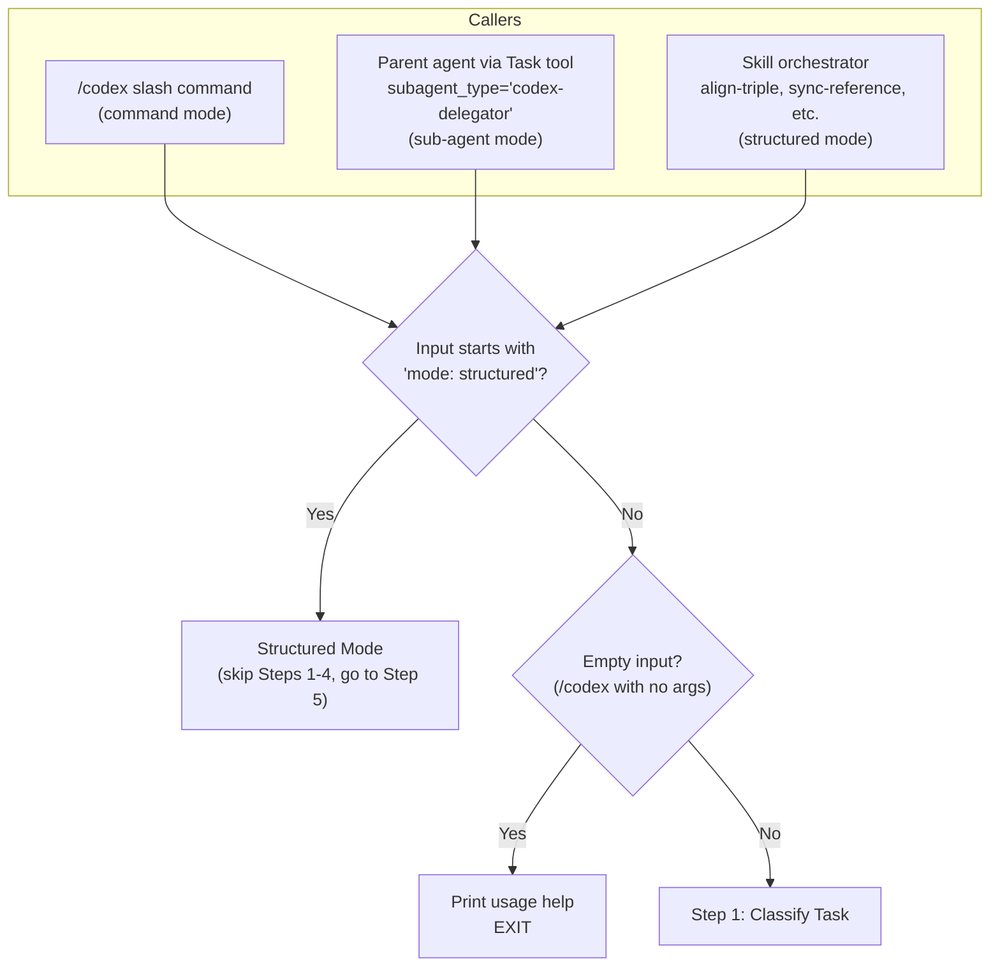
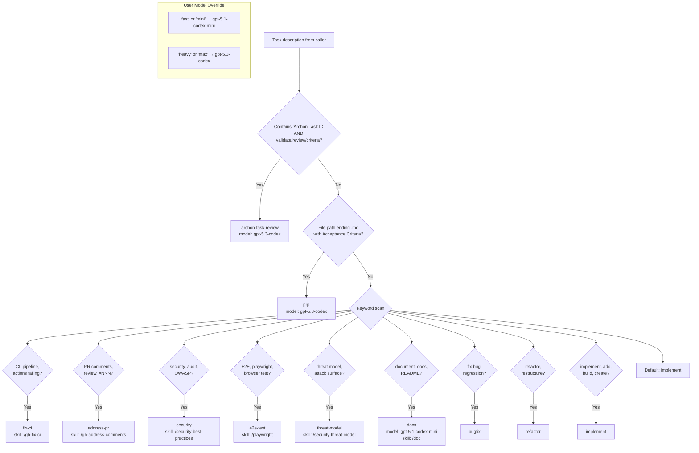
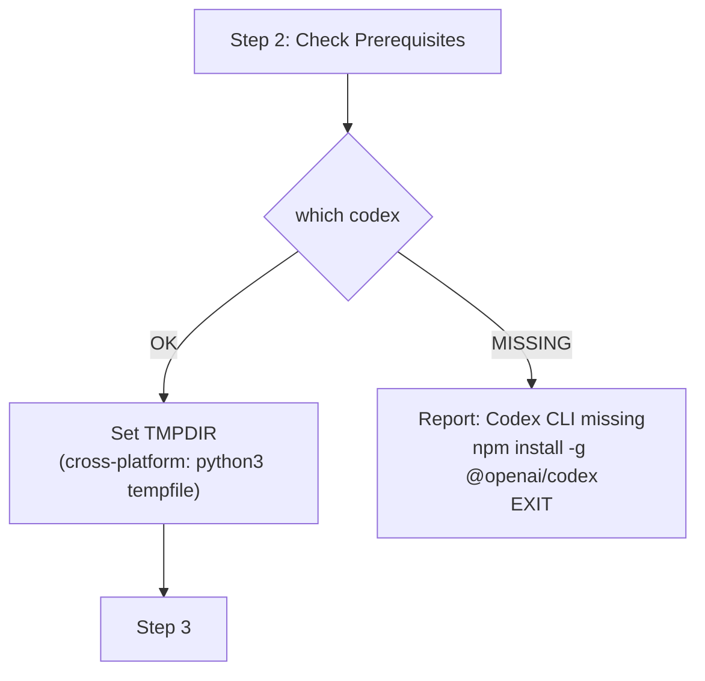
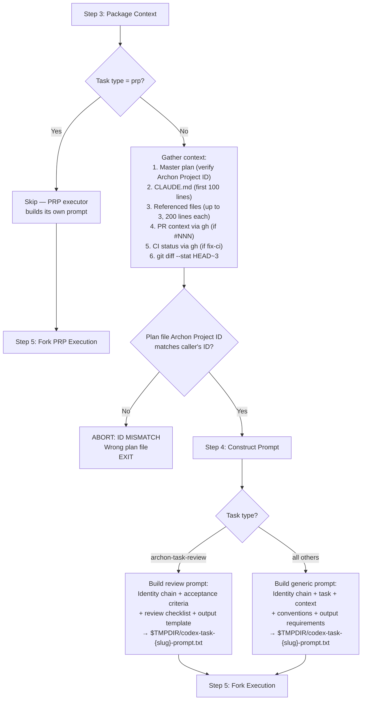
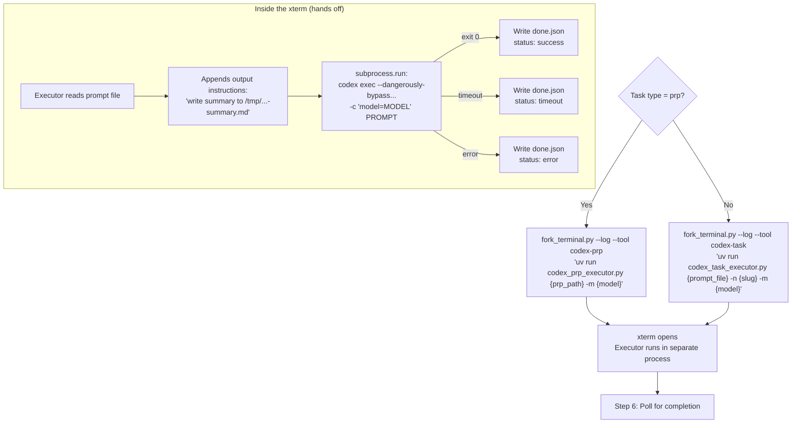
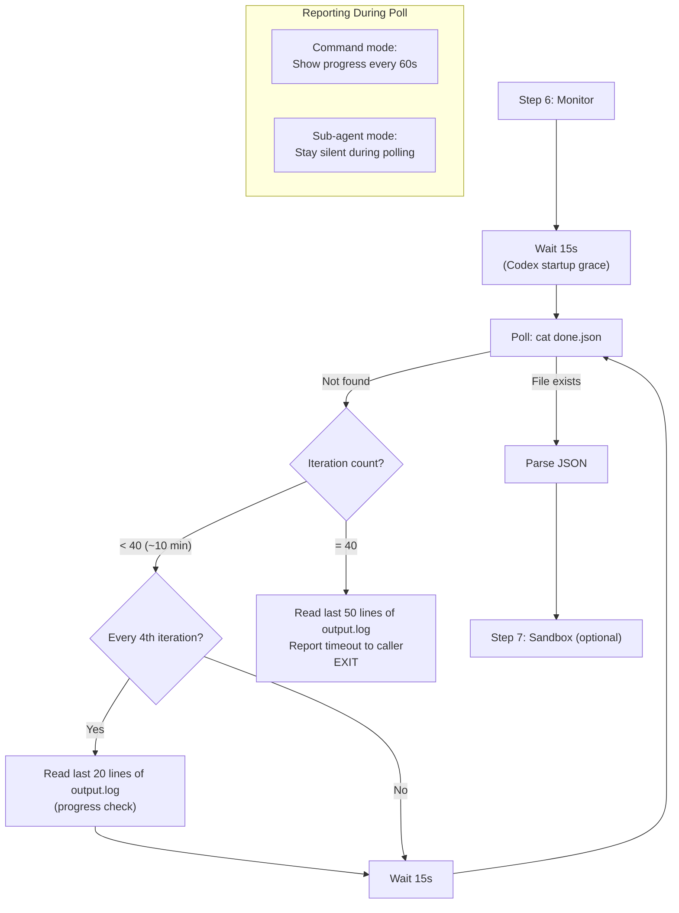
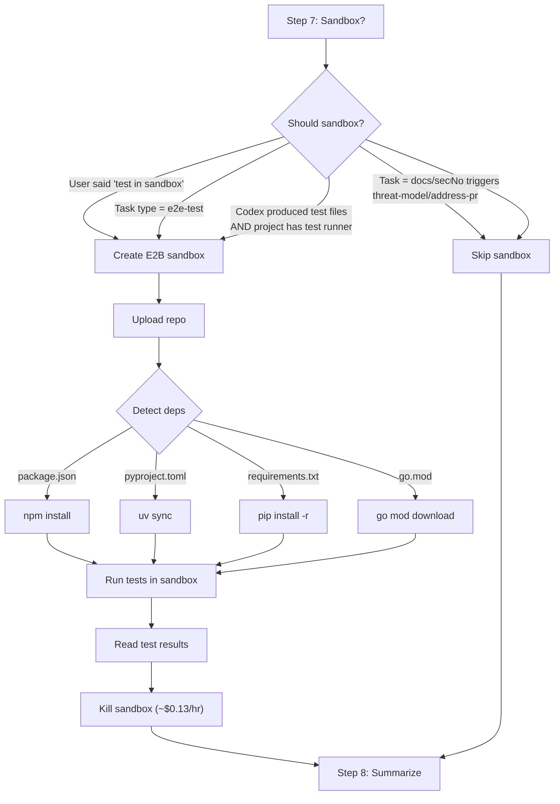
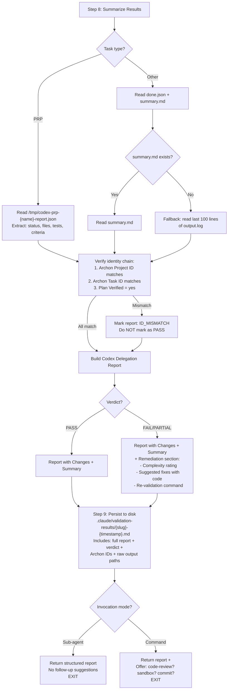
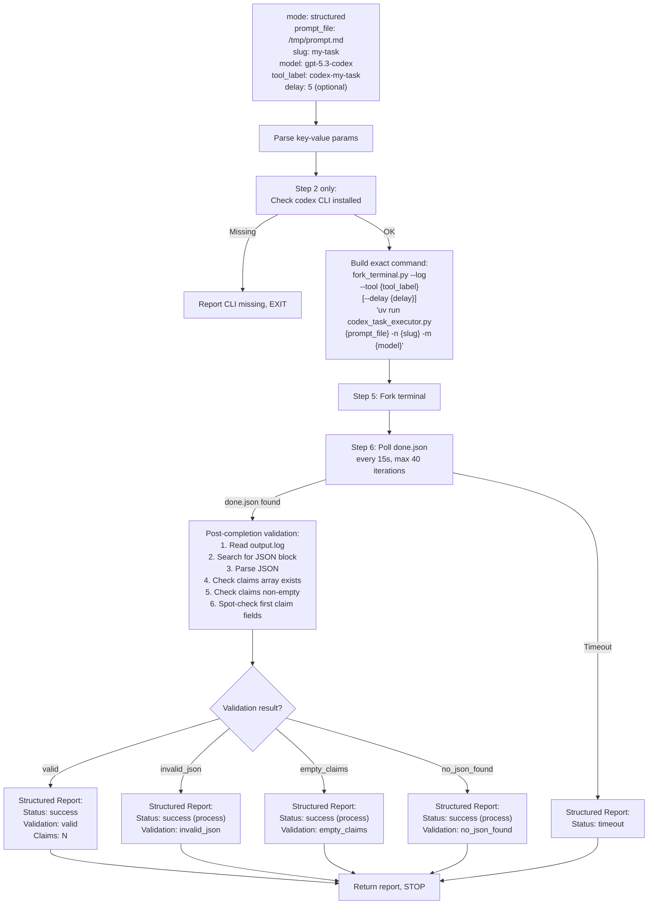

# Codex Delegator — Execution Flow Reference

Complete decision tree for every path through the codex-delegator agent, from invocation to final report.

## Who Calls This Agent



## Full Path: Standard Mode (Steps 1-9)

### Step 1: Task Classification



### Step 2: Prerequisites



### Steps 3-4: Context Gathering & Prompt Construction



### Step 5: Fork Execution



### Step 6: Monitoring Loop



### Step 7: Optional Sandbox Validation



### Steps 8-9: Report & Persist



## Full Path: Structured Mode



## Output File Map

```
$TMPDIR/
├── codex-task-{slug}-prompt.txt          # Constructed prompt (Step 4)
├── codex-task-{slug}-output.log          # Full Codex stdout+stderr
├── codex-task-{slug}-done.json           # Completion flag (poll this)
├── codex-task-{slug}-summary.md          # Codex-written summary
├── codex-prp-{name}-output.log           # PRP variant
├── codex-prp-{name}-done.json            # PRP completion flag
├── codex-prp-{name}-report.json          # PRP structured report
└── fork-terminal.log                     # All fork launches (append)

Project:
└── .claude/validation-results/
    └── {slug}-{timestamp}.md             # Persisted report (Step 9)
```

## Failure Modes

| Failure | Where | done.json Status | Recovery |
|---------|-------|-----------------|----------|
| Codex CLI not installed | Step 2 | N/A (aborts before fork) | `npm install -g @openai/codex` |
| Prompt file unreadable | Executor startup | `error`, `PROMPT_READ_FAILED` | Check path, re-write prompt |
| Codex timeout (>10 min) | Executor runtime | `timeout` | Increase timeout, simplify task |
| Codex exit non-zero | Executor runtime | `error`, `EXEC_FAILED` | Read output.log for diagnostics |
| Rate limited (429) | Executor runtime | `error`, retries exhausted | Wait, try different model |
| Auth failure | Codex runtime | `error` (exit non-zero) | Check GPT+ OAuth or OPENAI_API_KEY |
| Archon ID mismatch | Step 3 or Step 8 | N/A | Wrong plan file, verify Project ID |
| Process-level success but no output | Step 8 | `success` (exit 0) | Read output.log, model gathered data but couldn't write. Model/tool issue. |
| Bash permission denied | Step 5 (sub-agent) | N/A (never forks) | Delegator needs `Bash(*)` in tool permissions |
