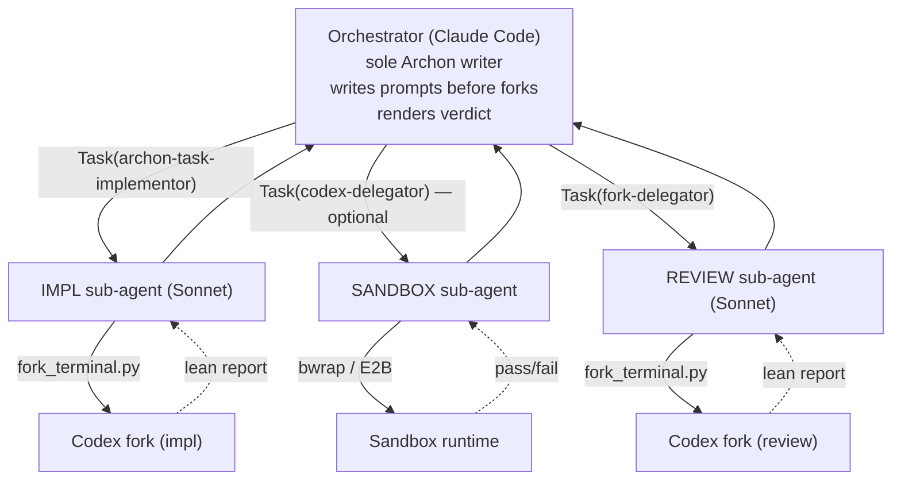
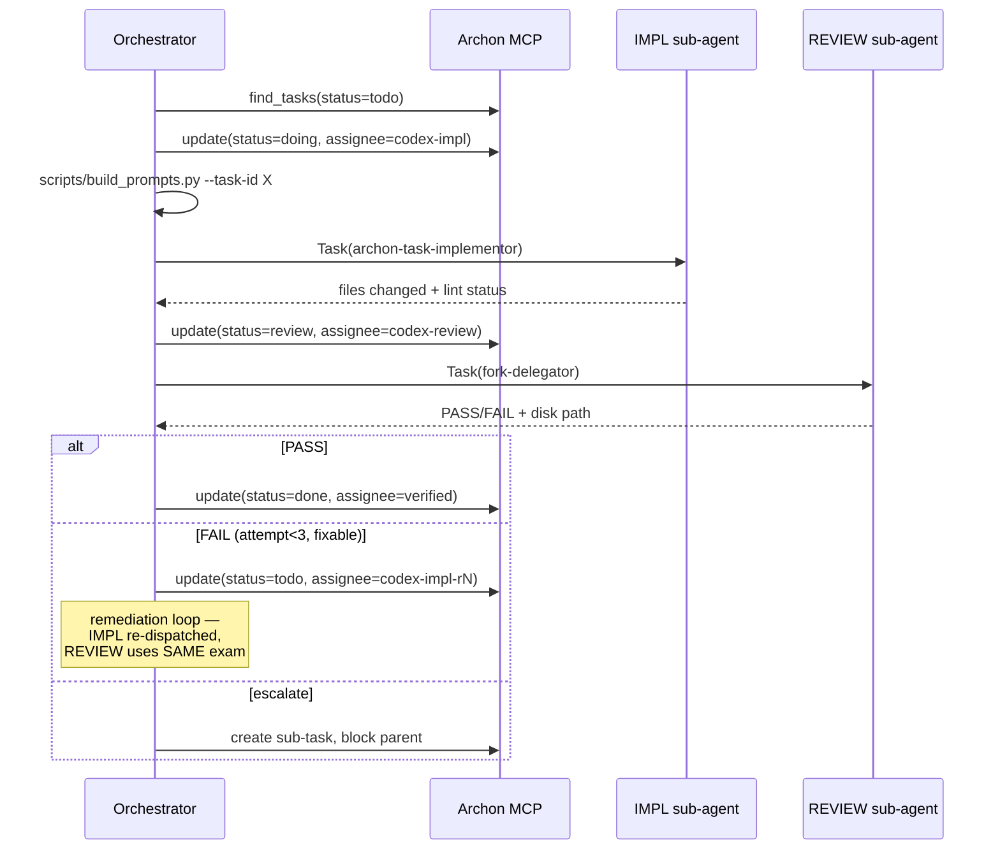

# archon-dual-fork

Protocol for executing one Archon task across **two Codex forks** — IMPL seat writes code, REVIEW seat grades it against the verbatim acceptance criteria — with Claude Code as the orchestrator and sole Archon writer. Structurally prevents a self-graded exam.

## When to Use

- Archon task with explicit acceptance criteria and files scope
- Reviewer must not see or modify implementor's output before grading
- Orchestrator needs lean sub-agent reports, not raw Codex output
- Codex's Archon MCP read access is available (forks self-enrich context)

**Do NOT use for:**
- Tasks without acceptance criteria (use `codex-delegator` directly)
- Quick one-line fixes (overhead not worth it)
- Tasks where orchestrator wants a single-agent implement-and-validate (use `archon-task-implementor` standalone)

## Architecture

Three tiers — orchestrator never babysits fork terminals:



## Seat Contracts

| Seat | Sub-agent | Does | Never does |
|------|-----------|------|------------|
| IMPL | `archon-task-implementor` | Read plan + patterns, implement, lint, report files changed | Write validation criteria, grade itself |
| REVIEW | `fork-delegator` | Run orchestrator's pre-written exam, emit PASS/FAIL + remediation | Modify files, propose patches |
| SANDBOX (optional) | `codex-delegator` | Smoke-test execution in bwrap/E2B | Render verdict |

Cadence (sequential, pipelined, concurrent) is the orchestrator's call — not prescribed here.

## Task Lifecycle



## Assignee Protocol

| State | Assignee | Meaning |
|-------|----------|---------|
| `todo` (fresh) | planner or unassigned | Not dispatched |
| `doing` | `codex-impl` | IMPL seat running |
| `doing` | `codex-sandbox` | SANDBOX seat running |
| `review` | `codex-review` | REVIEW seat running |
| `review` | `orchestrator-verdict` | Rendering verdict |
| `done` | `verified` | Passed |
| `todo` (fail) | `codex-impl-r{N}` | Back for fix, attempt N |
| `todo` (escalated) | `user-escalated` | Needs human |

Orchestrator updates assignee on every `manage_task` call.

## Invocation Recipe

```bash
# 1. Preflight
uv run .claude/skills/archon-dual-fork/scripts/preflight.py

# 2. Build both prompts from one Archon task
uv run .claude/skills/archon-dual-fork/scripts/build_prompts.py --task-id <UUID>
# emits /tmp/codex-impl-{slug}-prompt.txt and /tmp/codex-review-{slug}-prompt.txt

# 3. Orchestrator dispatches two sub-agents sequentially (or pipelined)
#    via Task() calls — see cookbook/example-flows.md for the shape
```

Heavy reference:
- `prompts/impl_seat.template.md` — IMPL seat prompt skeleton
- `prompts/review_seat.template.md` — REVIEW seat prompt skeleton
- `cookbook/example-flows.md` — sequential + pipelined invocation recipes

## Failure Categories

REVIEW seat emits one of these on FAIL (controlled vocabulary for self-improvement mining):

`criteria-unmet` · `regression` · `lint-fail` · `schema-drift` · `test-fail` · `incomplete` · `misread-spec`

Orchestrator appends `(category, attempt, slug, timestamp)` to the Archon task description's traceability log.

## Field Notes

Append one-liners to `field-notes.md` (in this skill dir) whenever the skill feels wrong during a live run. Tag `[breaking]` if a run broke in a new way. Mined during maintenance passes — not analyzed in-flight.

## Common Mistakes

- **Reviewer modified files** — exam integrity breach. Orchestrator MUST `git status` after the REVIEW fork returns; if dirty, hard-fail and escalate.
- **Reusing the IMPL prompt for retries without remediation context** — the reviewer will catch the same failure. Append remediation bullets to IMPL prompt on retry.
- **Modifying the REVIEW prompt between retries** — never. Same exam every attempt. Only IMPL prompt evolves.
- **Orchestrator polls `done.json` directly** — that's the sub-agent's job. Orchestrator only reads the sub-agent's lean report.
- **Skipping the assignee update** — loses liveness info. Update assignee on EVERY state transition.

## Issues & Improvement Ideas

- fork-delegator sandbox port (Phase 7 from codex-delegator) — until merged, SANDBOX seat uses codex-delegator
- Pipelined cadence prototype (review task N while impl task N+1) — requires task-independence check
- Stricter reviewer-write-detection — hash-based snapshot vs current `git status` check
- Failure-category mining Tier-2 agent — consume traceability logs, suggest prompt template improvements
