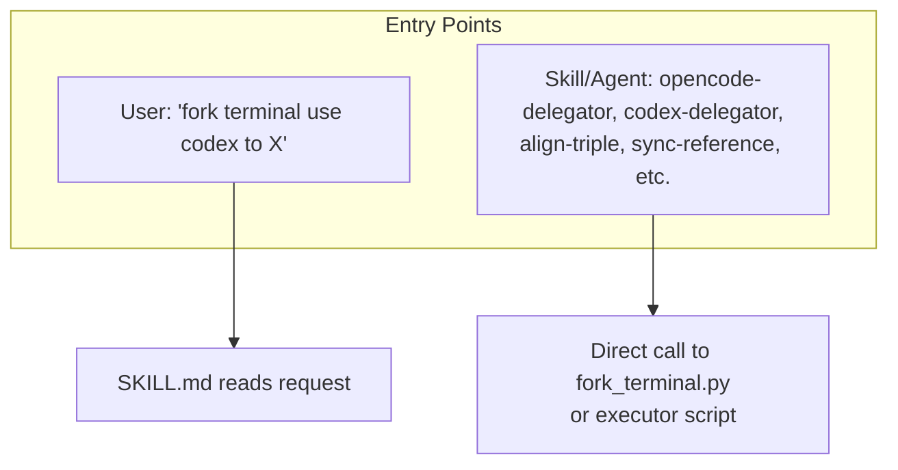
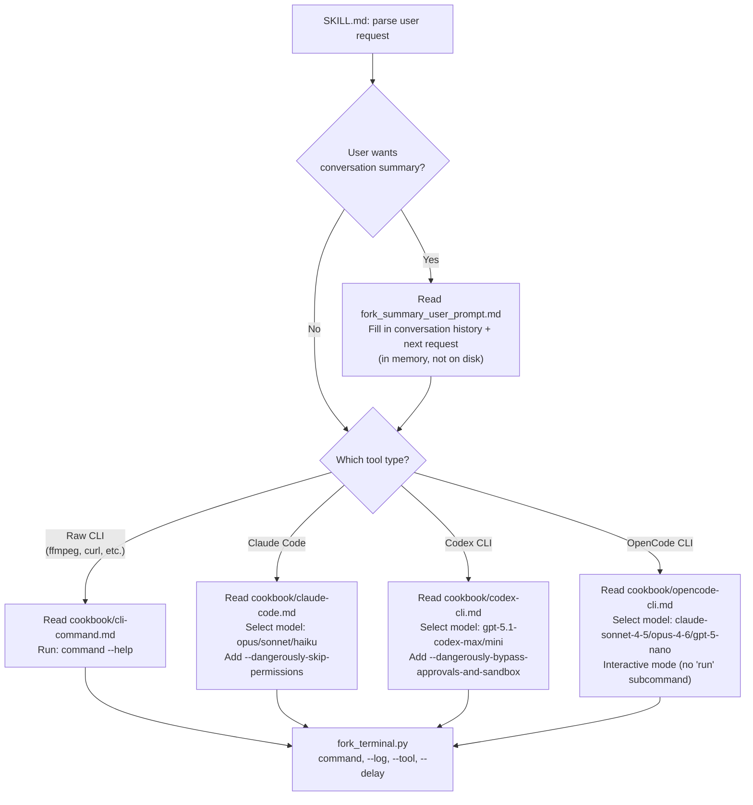
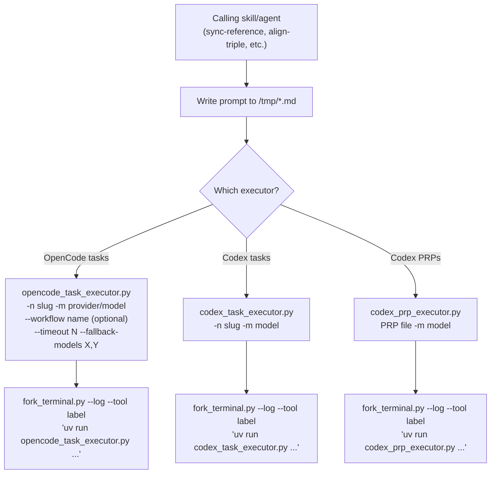
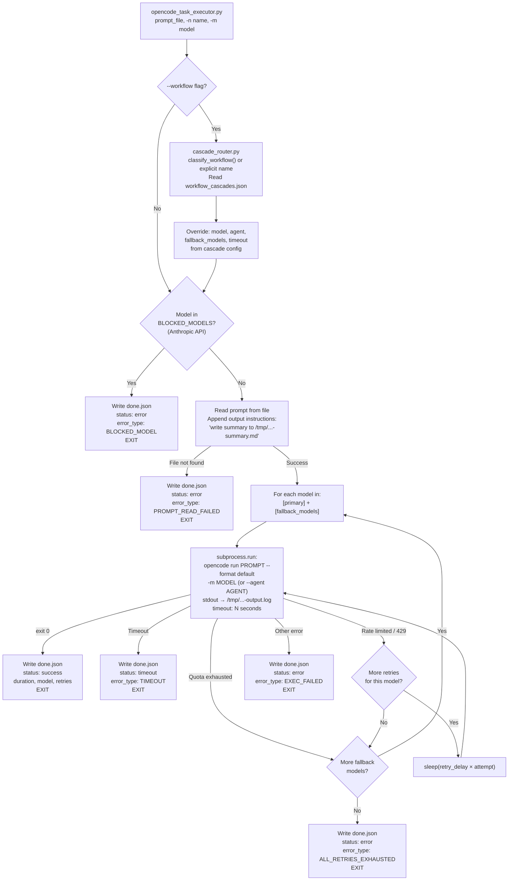
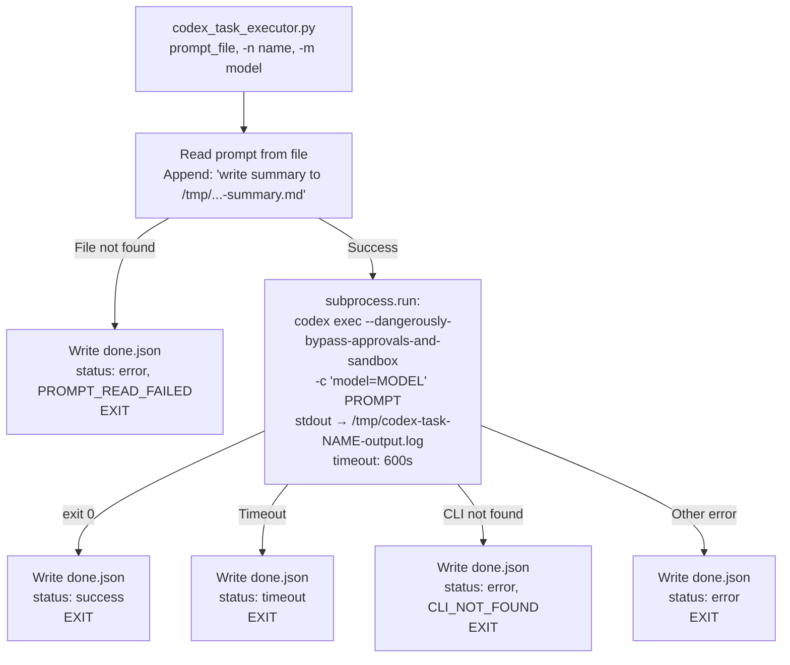
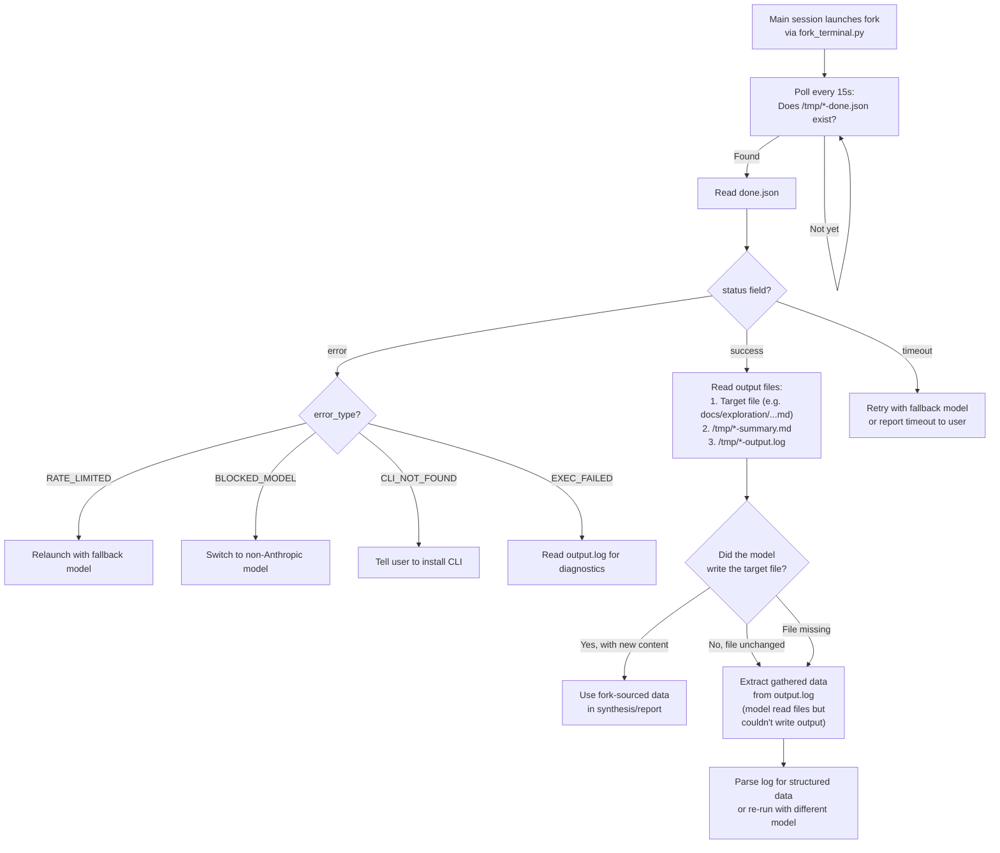

# Fork Terminal

Fork terminal sessions to new windows with various CLI agents or raw commands.

---

## Purpose

Enables spawning new terminal windows with Claude Code, Codex CLI, OpenCode CLI, or raw CLI commands, optionally including conversation context summaries.

## Activates On

- Fork terminal
- New terminal window
- Spawn CLI agent
- Claude Code in new terminal
- Codex CLI
- OpenCode CLI

## File Count

7 files across 4 directories

## Core Capabilities

### Agent Forking
Launch Claude Code, Codex CLI, or OpenCode CLI in a new terminal with optional context.

### Raw Command Execution
Fork a terminal with any CLI command (ffmpeg, curl, python, etc.).

### Context Summarization
Optionally pass conversation summary to the new agent for continuity.

## Supported Agents

| Agent | Flag | Description |
|-------|------|-------------|
| Claude Code | ENABLE_CLAUDE_CODE | Anthropic's CLI |
| Codex CLI | ENABLE_CODEX_CLI | OpenAI's Codex |
| OpenCode CLI | ENABLE_OPENCODE_CLI | OpenCode agent |
| Raw Commands | ENABLE_RAW_CLI_COMMANDS | Any CLI tool |

## Platform Support

- **macOS**: Uses AppleScript with Terminal.app
- **Windows**: Uses cmd.exe with start command
- **Linux**: Supports gnome-terminal, konsole, xfce4-terminal, alacritty, kitty, xterm

## Directory Structure

```
fork-terminal/
├── SKILL.md           # Main skill instructions
├── README.md          # This file
├── cookbook/          # Agent-specific instructions
│   ├── claude-code.md
│   ├── codex-cli.md
│   ├── opencode-cli.md
│   └── cli-command.md
├── prompts/           # Prompt templates
│   └── fork_summary_user_prompt.md
└── tools/             # Implementation
    └── fork_terminal.py
```

## Related Components

- **Agents**: context-manager
- **Workflows**: feature-development

## Execution Flow

There are two distinct paths through this skill: **interactive** (user asks to fork a terminal) and **programmatic** (another skill/agent delegates work). The diagram below covers every decision point and outcome.

### Entry Points



### Path 1: Interactive (via SKILL.md)



### Path 2: Programmatic (via executor scripts)



### fork_terminal.py: Platform Detection

```mermaid
flowchart TB
    FORK["fork_terminal.py called"] --> LOG{"--log flag?"}
    LOG -->|Yes| WRITE_LOG["Append to /tmp/fork-terminal.log<br/>{timestamp, tool, command, cwd, delay}"]
    LOG -->|No| DELAY_CHECK

    WRITE_LOG --> DELAY_CHECK{"--delay > 0?"}
    DELAY_CHECK -->|Yes| SLEEP["sleep(delay) seconds<br/>(quota staggering)"]
    DELAY_CHECK -->|No| PLATFORM

    SLEEP --> PLATFORM{"platform.system()"}

    PLATFORM -->|Darwin| MAC["osascript: Terminal.app do script"]
    PLATFORM -->|Windows| WIN["cmd /c start cmd /k"]
    PLATFORM -->|Linux/WSL| LINUX_DETECT{"Detect terminal emulator"}

    LINUX_DETECT -->|gnome-terminal| GNOME["gnome-terminal -- bash -c '...'"]
    LINUX_DETECT -->|konsole| KDE["konsole -e bash -c '...'"]
    LINUX_DETECT -->|xfce4-terminal| XFCE["xfce4-terminal -e '...'"]
    LINUX_DETECT -->|alacritty| ALAC["alacritty -e bash -c '...'"]
    LINUX_DETECT -->|kitty| KITTY["kitty bash -c '...'"]
    LINUX_DETECT -->|xterm| XTERM["xterm -e bash -c '...'"]
    LINUX_DETECT -->|None found| ERROR["NotImplementedError"]

    MAC --> XTERM_OPEN["New terminal window opens<br/>running command in cwd"]
    WIN --> XTERM_OPEN
    GNOME --> XTERM_OPEN
    KDE --> XTERM_OPEN
    XFCE --> XTERM_OPEN
    ALAC --> XTERM_OPEN
    KITTY --> XTERM_OPEN
    XTERM --> XTERM_OPEN
```



### OpenCode Executor: Full Lifecycle



### Codex Executor: Full Lifecycle



### Caller Polling: How the Main Session Knows It's Done



### Output File Map

```
/tmp/
├── fork-terminal.log                          # All fork launches (append-only)
├── opencode-task-{name}-output.log            # Full OpenCode stdout+stderr
├── opencode-task-{name}-done.json             # Completion flag (poll this)
├── opencode-task-{name}-summary.md            # Summary (if model writes it)
├── codex-task-{name}-output.log               # Full Codex stdout+stderr
├── codex-task-{name}-done.json                # Completion flag (poll this)
├── codex-task-{name}-summary.md               # Summary (if model writes it)
└── codex-prp-{name}-done.json                 # PRP completion flag

Target files (written by the model, not the executor):
├── docs/exploration/sync-reference-*.md       # sync-reference outputs
├── docs/audits/align-triple-*/                # align-triple outputs
└── (whatever the prompt instructs)
```

---

**Part of**: claude-code-templates
