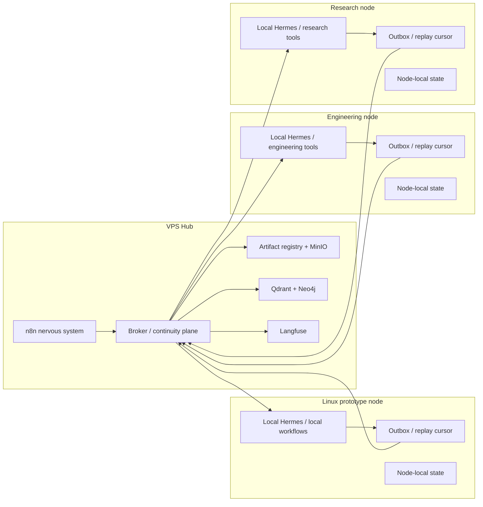

# 1215-VPS Inter-Node Data Flow

This document defines how the VPS and local nodes exchange data. The default model is **hub-and-spoke**:

- the **VPS is the shared continuity hub**
- local nodes **publish to** and **consume from** the VPS
- local nodes do **not** communicate directly with each other in v1 unless a specific use case justifies it

Being on the same network does not imply direct node-to-node coupling. The architecture favors a single canonical shared state plane over peer mesh behavior.

## Node Types

| Node | Role | Primary runtime | Primary responsibility |
|---|---|---|---|
| `VPS hub` | Shared continuity and orchestration hub | Linux VPS | Continuity plane, `n8n`, Open WebUI, Paperclip, shared retrieval, observability |
| `Linux prototype` | First local reference node | Linux workstation | Prototype and validate the node pattern before broad rollout |
| `Engineering node` | Workstation execution node | Windows + WSL2 | Engineering Hermes workloads and local artifacts |
| `Research node` | Workstation execution node | macOS | Research Hermes workloads and local artifacts |

## Topology Model

## Data Classes

### 1. Shared continuity data
This is the data that belongs in the shared hub and should be available for replay, coordination, and cross-node reasoning.

Examples:

- broker events
- task and run metadata
- execution summaries
- approved memory outputs
- artifact manifests
- trace correlation identifiers
- shared decisions, blockers, hypotheses, and results

**Default rule**
- published from nodes to VPS
- replayed from VPS to nodes when needed

### 2. Private node-local state
This is state that should remain on the node by default.

Examples:

- local Hermes sessions
- local workspaces
- provider-specific local stores
- temporary execution files
- machine-specific credentials and secrets
- tool caches

**Default rule**
- stays local
- never replicated automatically

### 3. Published derivatives
This is data derived from local or shared activity and intentionally promoted into the shared system.

Examples:

- embeddings
- graph facts
- artifact metadata
- approved summaries
- execution results
- structured memory extracts

**Default rule**
- published to VPS after filtering and normalization
- does not bypass the broker/continuity contract

## Allowed and Forbidden Flows

| Flow | Default policy | Notes |
|---|---|---|
| `Local node -> VPS` | Allowed | Primary publish path |
| `VPS -> Local node` | Allowed | Replay, sync, and coordination path |
| `Local node -> Local node` | Forbidden by default | Add only for explicit use cases later |
| `Local node -> shared storage directly` | Avoid by default | Prefer broker-mediated registration and traceability |
| `Memory provider -> other node directly` | Forbidden | Keep provider isolation intact |

## Push / Pull Model

The default behavior is **hybrid**:

- nodes **push** new continuity events and artifact metadata to the VPS
- nodes **pull** replay, assignments, and shared context from the VPS

This model is preferred because:

- offline local nodes can keep an outbox
- replay is easier to reason about than peer-to-peer reconciliation
- the VPS remains the canonical place for audit and lineage

## Transport Paths

| Flow type | Transport |
|---|---|
| Continuity publish | Tailscale + HTTPS to broker/API or workflow ingress |
| Continuity replay | Tailscale + HTTPS pull from broker/API |
| Artifact upload | Tailscale + S3-compatible upload to MinIO, registered through broker |
| Trace ingestion | HTTPS to Langfuse or broker-correlated trace path |
| Workflow invocation | HTTPS to `n8n` or stable tool endpoint |

Direct raw database access from local nodes is not the default contract. Prefer service-level APIs over direct DB writes.

## Replay and Conflict Model

### Outbox
Each local node should maintain:

- a local outbox of unpublished events
- a replay cursor for the last acknowledged shared event

### Idempotency
Every published continuity event should carry:

- stable event ID
- node ID
- local session/run context
- idempotency key

### Conflict handling
The VPS hub owns ordering and acceptance. In v1:

- nodes do not coordinate conflicts directly with each other
- the hub records accepted order
- nodes reconcile by replaying from the hub

This is simpler and more auditable than peer conflict negotiation.

## Why Not Direct Local-Node Communication

Direct node-to-node communication is intentionally deferred because it adds:

- multiple trust boundaries
- harder audit trails
- more complicated replay semantics
- greater risk of memory and artifact drift
- harder operational debugging

A direct local-node path may be justified later for:

- large artifact transfer optimization
- peer discovery or heartbeat
- VPS outage fallback

Until then, all meaningful shared coordination should traverse the VPS hub.

## Relationship to the Local Prototype

The Linux prototype should be treated as the first implementation of the local-node pattern:

- same publish/replay model
- same outbox/cursor assumptions
- same distinction between local private state and shared published derivatives

That lets the local prototype become the template for future Engineering and Research nodes instead of a throwaway dev stack.

## Acceptance Criteria

The inter-node model is ready when:

- every node type has a clear publish path
- every node type has a clear replay path
- direct local-node communication is not required for normal operation
- local-private state is clearly separated from shared continuity data
- artifact and trace flows are explicit
- outbox and replay semantics are defined well enough to implement without architecture decisions
