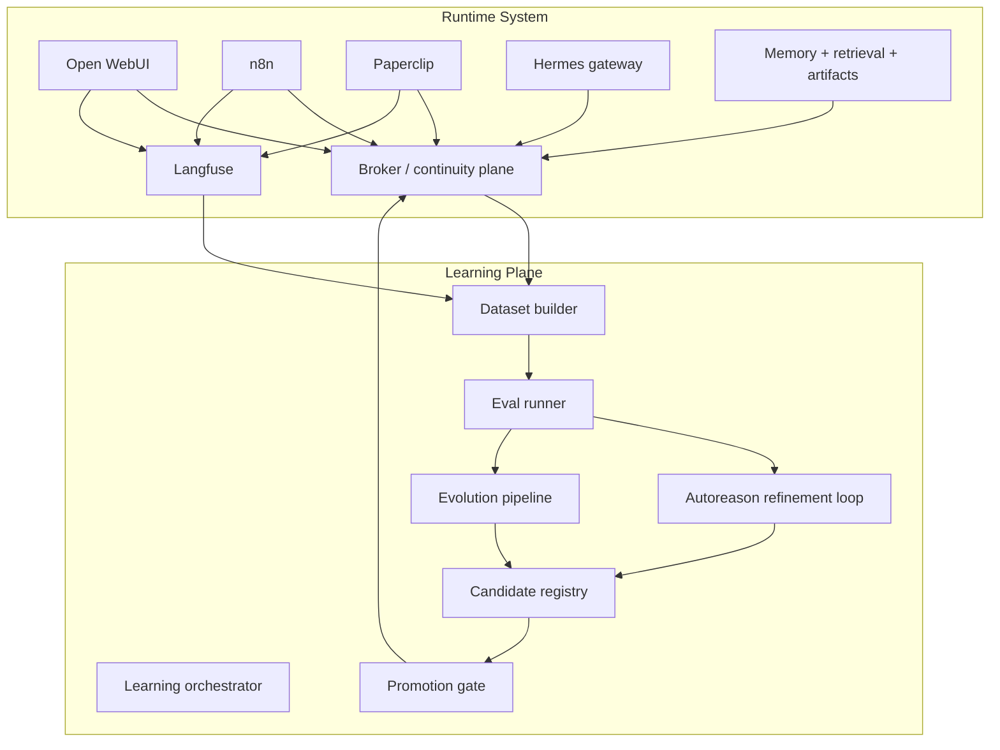

# 1215-VPS Learning Plane

This document defines how learning and self-improvement loops fit into the
architecture without destabilizing the live runtime.

The short version:

- `autoreason` contributes an **evaluation and refinement strategy**
- `hermes-agent-self-evolution` contributes a **practical optimization pipeline**
- neither belongs on the always-on request path
- both belong in a separate **learning plane** that observes production,
  evaluates candidates offline, and promotes changes through explicit policy

The learning plane is first-class, but it is **not** the continuity plane, the
workflow nervous system, or a primary user-facing surface.

## Why a Separate Learning Plane Exists

The runtime system has to be stable, auditable, and legible:

- user-facing requests must be predictable
- memory and artifact lineage must remain traceable
- failures must be debuggable
- production behavior must not drift because an optimizer edited the system

Self-improvement loops have a different shape:

- they need broad access to traces and benchmark data
- they generate candidate prompts, skills, or code
- they require repeated evaluation and rollback-friendly comparison
- they often work best with temporary experimentation and controlled mutation

That makes them a separate architectural concern.

## Relationship to the Reference Modules

### `autoreason`
[`modules/autoreason`](</mnt/data/Documents/repos/1215-vps/modules/autoreason/README.md>)
is best understood as a **method**:

- incumbent vs revision vs synthesis
- blind judging by fresh evaluators
- explicit "no change" as a first-class outcome

It is useful inside this system as:

- a candidate-comparison strategy
- a structured critique and synthesis loop
- a way to avoid constant degradation from endless self-editing

It is **not** a runtime service that should sit next to Open WebUI or n8n.

### `hermes-agent-self-evolution`
[`modules/hermes-agent-self-evolution`](</mnt/data/Documents/repos/1215-vps/modules/hermes-agent-self-evolution/README.md>)
is closer to a reusable **learning-plane implementation**:

- dataset builder
- fitness scoring
- constraint gates
- evolution of skills, prompts, and tool descriptions
- PR-oriented review workflow

This is a stronger architectural fit. It maps well onto:

- scheduled evaluation jobs
- benchmark and replay runners
- candidate artifact generation
- human-reviewed promotion

It should still live off the request path and behind explicit guardrails.

## Core Principle

The runtime system **serves and records**.

The learning plane **observes, evaluates, evolves, and proposes**.

Promotion into active behavior is a separate step.

## Layer Placement

## Learning Plane Components

### 1. Learning orchestrator
Coordinates learning jobs:

- scheduled benchmark runs
- candidate generation jobs
- evaluation campaigns
- post-incident improvement loops

This can be implemented as:

- a repo-owned worker
- `n8n`-scheduled jobs
- or both

It should not itself become the place where candidate state is permanently
stored.

### 2. Dataset builder
Builds evaluation datasets from:

- broker events
- Langfuse traces
- curated failure cases
- benchmark corpora
- explicit golden datasets

This is where `hermes-agent-self-evolution` already has a useful starting point.

### 3. Eval runner
Executes replay and benchmark tasks in a sandbox:

- held-out tasks
- synthetic tasks
- incident regression cases
- node-specific replay cases

The eval runner must be isolated from production state mutation.

### 4. Autoreason refinement loop
Uses the `autoreason` pattern to compare:

- incumbent candidate `A`
- adversarial revision `B`
- synthesis `AB`

This is especially useful for:

- skill text
- prompt sections
- workflow descriptions
- tool selection guidance

It should be treated as an evaluation and mutation strategy, not as a top-level
service.

### 5. Evolution pipeline
Wraps candidate generation and optimization:

- skill evolution
- prompt evolution
- tool-description evolution
- later, selective code evolution

`hermes-agent-self-evolution` is the best current reference for this part.

### 6. Candidate registry
Stores candidate artifacts and scores:

- candidate ID and lineage
- source baseline version
- benchmark and judge scores
- constraint-gate results
- trace and broker links

Candidate artifacts should be stored in MinIO and registered in the broker.

### 7. Promotion gate
Controls what becomes active:

- human review for production promotion
- versioned rollout target
- rollback path
- node-scoped canary rollout

This is intentionally separate from candidate generation.

## Runtime Inputs to the Learning Plane

The learning plane consumes:

- broker events
- run/session history
- workflow outcomes
- memory recall outcomes
- artifact manifests
- Langfuse traces
- curated benchmark cases
- explicit failure reports

It does **not** get a license to mutate runtime data in place.

## Outputs From the Learning Plane

The learning plane emits:

- candidate skills
- candidate prompt sections
- candidate tool descriptions
- benchmark reports
- evaluation traces
- promotion decisions
- rollback recommendations

These outputs should be published back into the continuity plane as artifacts and
events.

## Promotion Model

### Default model: human-promoted

For production-affecting changes, the default should be:

1. generate candidate
2. evaluate candidate
3. register candidate + scores
4. human approval
5. canary rollout
6. wider adoption if it holds

This is the safest model for a system that is simultaneously:

- a user-facing tool
- a memory system
- an orchestration runtime
- a multi-node shared continuity system

### How this differs from `autoresearch`

Karpathy's [`autoresearch`](https://github.com/karpathy/autoresearch) is much
closer to a **narrow autonomous research loop**:

- one constrained target
- one experimental codebase
- fixed metric
- repeated autonomous mutation and evaluation
- self-directed overnight iteration

That is a good shape for:

- model training experiments
- narrowly scoped algorithm search
- isolated research sandboxes

It is **not** the default shape for this architecture, because this architecture
is a live, multi-service, memory-bearing production system.

So yes, this blueprint differs from `autoresearch` in an important way:

- `autoresearch` assumes autonomous mutation is the point
- this blueprint assumes autonomous mutation is useful, but promotion into live
  behavior must be gated

### Allowed autonomous mode

Autonomous promotion is still possible, but only inside a narrow boundary:

- local prototype node
- sandboxed benchmark environment
- non-production candidate lanes
- explicit rollback and compare-to-baseline

That makes autonomous research a **mode of the learning plane**, not the default
production policy.

## What Should Be Evolvable First

Highest value, lowest risk:

- skills
- prompt sections
- tool descriptions
- workflow descriptions and selection hints

Later, with stronger guardrails:

- retrieval ranking policies
- summarization policies
- memory publication filters
- selected implementation code

Highest risk and therefore last:

- broker semantics
- security policies
- approval gates
- direct runtime code paths on the production hub

## Guardrails

Every candidate must pass:

- held-out evaluation set
- regression checks
- explicit size and scope constraints
- no-secret-leak checks
- no-unapproved direct mutation of production config
- traceability back to source datasets and candidates

If code evolution is introduced, it must also pass:

- relevant automated tests
- sandbox replay
- rollback validation

## Node Placement

The best place to start this is **not** the production VPS hub.

The best first home is:

- the Linux prototype node

Why:

- cheaper failures
- faster iteration
- easier benchmark replay
- safer experimentation with autonomous loops

Once the learning plane is proven there, the VPS hub can host:

- shared candidate registry
- benchmark scheduling
- promotion records

while still keeping high-risk mutation execution off the critical path.

## Acceptance Criteria

The learning plane is architecturally ready when:

- runtime and learning responsibilities are clearly separated
- both reference modules have an explicit role
- candidate artifacts have storage and lineage rules
- promotion policy is defined
- autonomous experimentation is permitted only within a bounded sandbox
- production mutation requires explicit promotion logic
