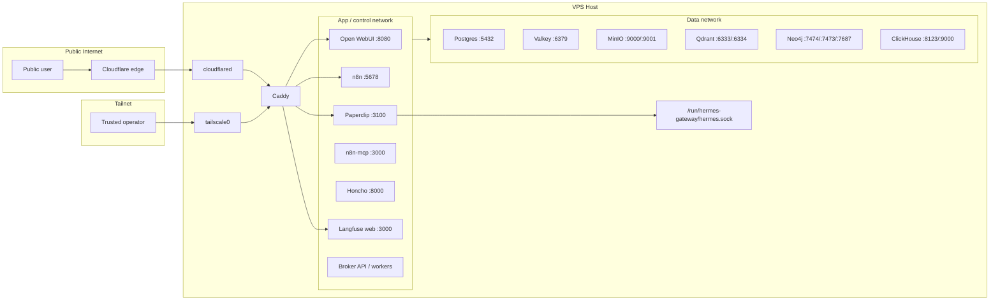

# 1215-VPS Network and Port Map

This document defines what binds where, which services are exposed, and which access path applies to each surface.

## Network Zones

## Exposure Policy

### Public
- `Open WebUI`
- `n8n`

### Tailnet-only
- `Paperclip`
- `Langfuse`
- `MinIO console`
- `Qdrant`
- `Neo4j`
- `Flowise` if retained
- `SearXNG` if retained
- `Supabase Studio` if retained

### Internal-only
- `Postgres / Supabase DB`
- `Valkey`
- `MinIO S3 API`
- `ClickHouse`
- `Honcho`
- `n8n-mcp`
- `Broker API / workers`

### Host-only
- `Hermes gateway` Unix socket
- `Hermes`
- Hermes profile and workspace directories

## Host-Bound Ports

| Host bind | Internal service | Reachability | Protection |
|---|---|---|---|
| `0.0.0.0:80/tcp` | `Caddy` | Public | Redirect / controlled ingress |
| `0.0.0.0:443/tcp` | `Caddy` | Public | Cloudflare Access or Tailscale-routed hostname policy |
| `0.0.0.0:443/udp` | `Caddy` | Public | HTTP/3 if enabled |
| `0.0.0.0:41641/udp` | `Tailscale` | Public transport, private auth | WireGuard mesh |
| `0.0.0.0:22/tcp` | `sshd` | Public or later tailnet-only | SSH auth and hardening |
| Unix socket only | `Hermes gateway` | Host filesystem only | Filesystem ACL and bind-mount control |

## Localhost-Only Binds

These are useful for local admin and debugging, but they are not user-facing architecture surfaces.

| Host bind | Service | Source |
|---|---|---|
| `127.0.0.1:8080` | Open WebUI | upstream private override |
| `127.0.0.1:5678` | n8n | upstream private override |
| `127.0.0.1:3000` | Langfuse web | upstream private override |
| `127.0.0.1:3030` | Langfuse worker | upstream private override |
| `127.0.0.1:5433` | Langfuse Postgres | upstream private override |
| `127.0.0.1:6379` | Valkey | upstream private override |
| `127.0.0.1:9010` | MinIO S3 | upstream private override |
| `127.0.0.1:9011` | MinIO console | upstream private override |
| `127.0.0.1:6333` / `6334` | Qdrant | upstream private override |
| `127.0.0.1:7474` / `7473` / `7687` | Neo4j | upstream private override |
| `127.0.0.1:8081` | SearXNG | upstream private override |
| `127.0.0.1:11434` | Ollama | upstream private override |

## Internal Listener Ports

These are the expected internal ports in the target design.

| Service | Internal port(s) | Exposure | Status |
|---|---|---|---|
| `Open WebUI` | `8080` | Public via Caddy + Cloudflare | Confirmed upstream |
| `n8n` | `5678` | Public via Caddy + Cloudflare | Confirmed upstream |
| `Paperclip` | `3100` | Tailnet-only via Caddy | Assumed for v1 from upstream quickstart |
| `n8n-mcp` | `3000` | Internal-only | Assumed for v1 |
| `Honcho API` | `8000` | Internal-only | Assumed for v1 and earlier design notes |
| `Langfuse web` | `3000` | Tailnet-only via Caddy | Confirmed upstream |
| `Langfuse worker` | `3030` | Internal-only | Confirmed upstream |
| `Postgres / Supabase DB` | `5432` | Internal-only | Confirmed upstream family |
| `Valkey` | `6379` | Internal-only | Confirmed upstream |
| `MinIO S3` | `9000` | Internal-only | Confirmed upstream |
| `MinIO console` | `9001` | Tailnet-only | Confirmed upstream |
| `Qdrant` | `6333`, `6334` | Tailnet-only or Internal-only | Confirmed upstream |
| `Neo4j` | `7473`, `7474`, `7687` | Tailnet-only or Internal-only | Confirmed upstream |
| `ClickHouse` | `8123`, `9000`, `9009` | Internal-only | Confirmed upstream |
| `SearXNG` | `8080` | Tailnet-only if retained | Confirmed upstream |
| `Flowise` | `3001` | Tailnet-only if retained | Confirmed upstream |
| `Ollama` | `11434` | Tailnet-only or Internal-only | Confirmed upstream |

## Routing Policy

### Public route set
- Public DNS terminates at Cloudflare
- Cloudflare Tunnel forwards only approved hostnames
- Cloudflare Access gates all public app access
- Caddy routes by hostname to internal services

### Tailnet route set
- Tailnet operators reach Caddy through Tailscale
- Caddy routes tailnet-only hostnames to admin and operator surfaces

### Internal route set
- Docker services resolve each other by service name on internal networks
- No internal data service is intentionally routed to public DNS

## Notes for Implementation
- `Paperclip :3100`, `n8n-mcp :3000`, and `Honcho :8000` should be treated as v1 architectural assumptions until locked by actual compose/build wiring.
- The implementation should preserve the policy model even if host binds differ temporarily during bootstrap.
