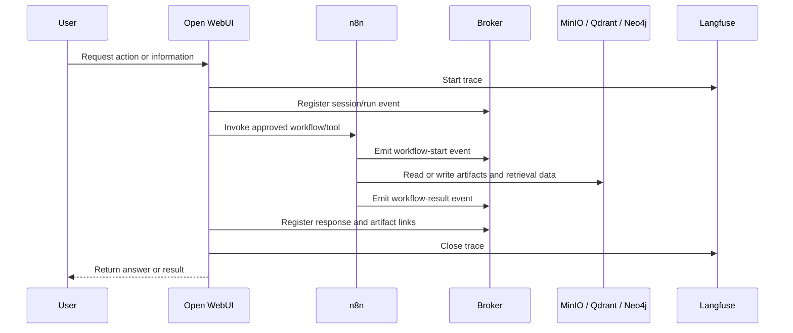
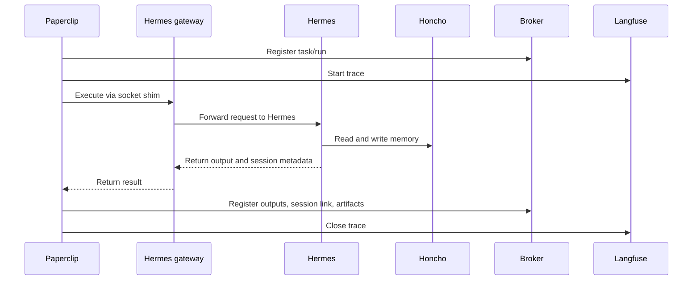
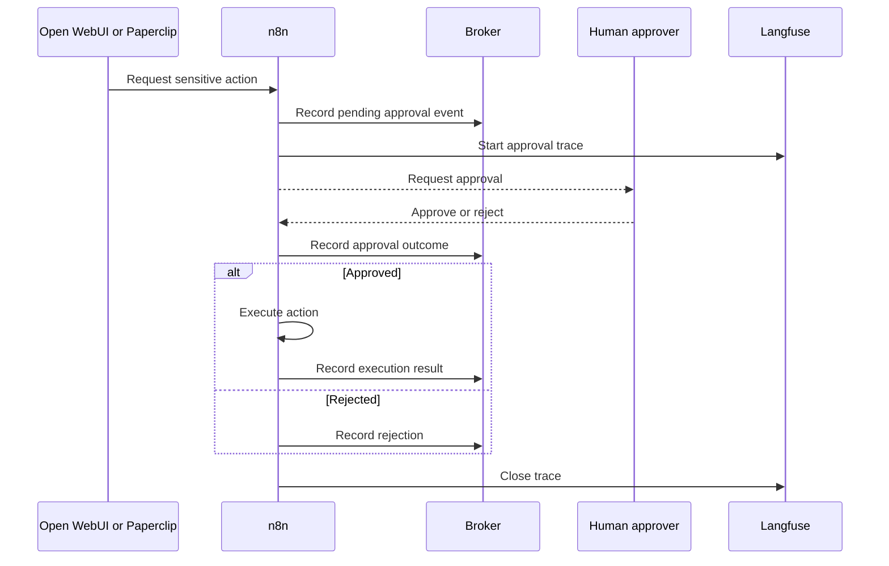
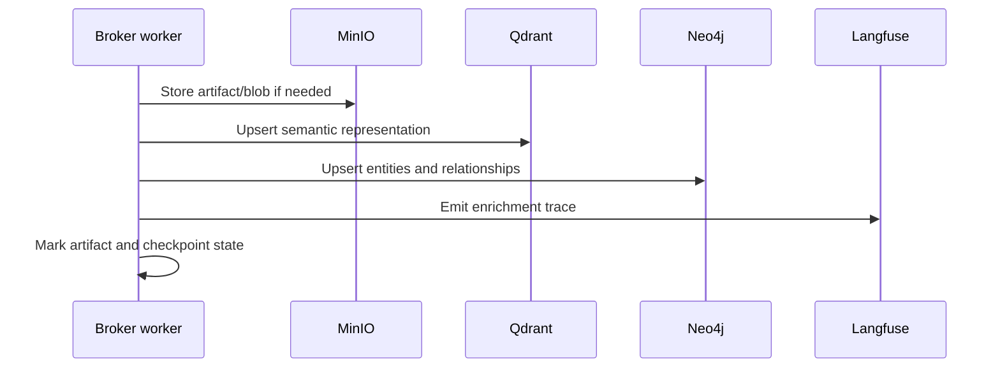
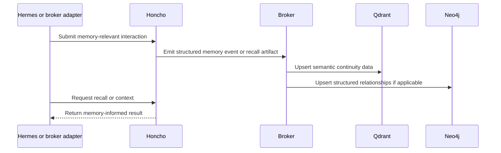

# 1215-VPS Runtime Flows

This document captures the important execution paths as swim lanes. Each flow is followed by the contract the implementation must honor.

## 1. Open WebUI Tool-Backed Action

**Trigger**
- User asks Open WebUI for a tool-backed action or enriched answer

**Required state writes**
- session/run registration at start
- workflow start/result events
- response event
- artifact link registration when files or documents are produced

**Trace points**
- Open WebUI request start
- workflow start and end
- artifact publication if applicable
- response completion

**Failure behavior**
- `n8n` failure returns a bounded error to Open WebUI
- broker still records failure state
- Langfuse trace closes with correlated error metadata

## 2. Paperclip Task Through Hermes Gateway

**Trigger**
- Paperclip heartbeat, approval, or manual task run invokes a Hermes-backed agent execution

**Required state writes**
- task/run creation
- execution result
- Hermes session linkage
- artifact registration when files are produced

**Trace points**
- Paperclip run start
- gateway invocation
- Hermes execution completion
- memory interaction summary if surfaced

**Failure behavior**
- gateway failure is visible to Paperclip as execution failure
- failed execution is still written to broker and trace system
- no direct host fallback path bypasses the gateway

## 3. Approval-Gated Sensitive Workflow

**Trigger**
- A request falls into a policy-defined sensitive class

**Required state writes**
- pending approval event
- approval or rejection event
- final execution event if approved

**Trace points**
- approval requested
- approval granted or denied
- execution result if applicable

**Failure behavior**
- absence of approval must fail closed
- timeout behavior records explicit non-completion or expiration

## 4. Brokered Enrichment Into Retrieval and Artifacts

**Trigger**
- A brokered event or artifact becomes eligible for enrichment

**Required state writes**
- artifact manifest
- enrichment status
- provider checkpoint or worker checkpoint

**Trace points**
- artifact write
- vector upsert
- graph upsert
- checkpoint completion

**Failure behavior**
- partial enrichment must be resumable
- one enrichment backend failing must not corrupt broker state

## 5. Memory Write and Recall Path

**Trigger**
- Hermes execution or adapter logic submits memory-relevant interaction data

**Required state writes**
- memory event or recall artifact
- optional vector or graph enrichment records

**Trace points**
- memory ingest
- memory recall
- downstream enrichment if performed

**Failure behavior**
- memory subsystem failure must degrade gracefully without blocking basic execution
- private and shared memory boundaries must remain intact even on failure
