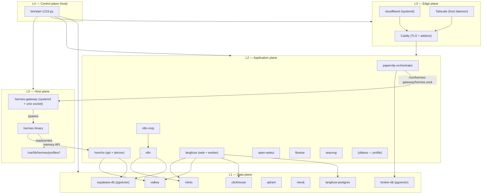
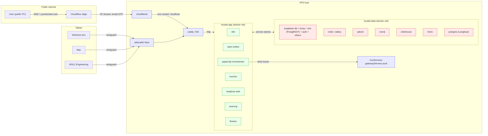
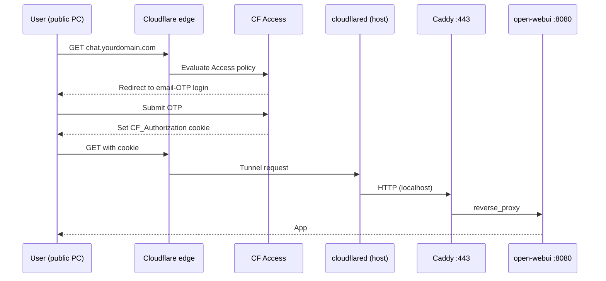
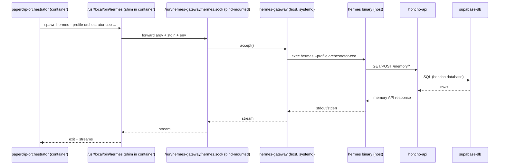
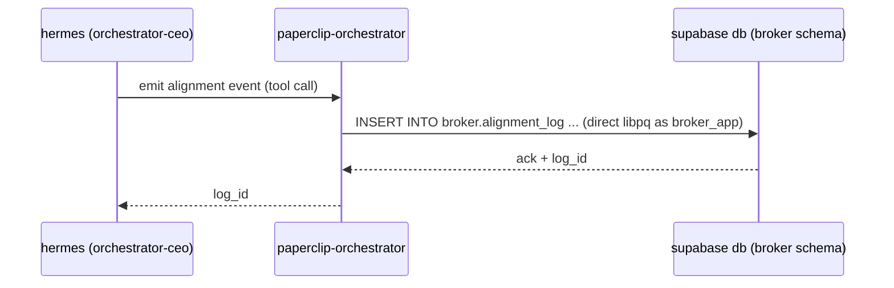
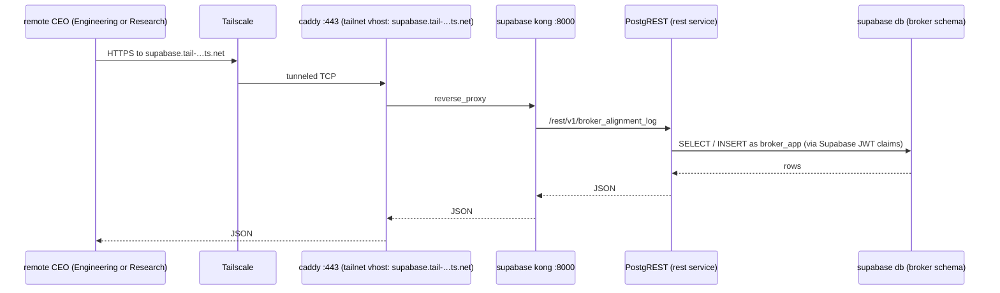

# 1215-VPS Design Spec

**Date:** 2026-04-20
**Status:** Draft — awaiting implementation plan
**Canonical:** This is the source of truth for what runs on the VPS.
Anything running on the VPS that is **not** described here is a bug to
either document or remove.

---

## 1. Scope

The VPS hosts the **Orchestrator slice** of a three-host architecture
described in `docs/Self-Hosted Long-Horizon Memory Architecture for
Three Hermes-Backed.md`:

- **Orchestrator Paperclip company** runs here. Its CEO is a Hermes
  agent using **self-hosted Honcho** for personal memory.
- **Shared broker layer** runs here and is the durable inter-company
  contract: append-only alignment log, shared fact graph, shared
  semantic corpus, artifact manifests, execution traces.
- **Engineering** (WSL2) and **Research** (macOS) CEOs live on other
  hosts and publish into the broker over Tailscale. They do not run
  on this VPS.

Secondary purposes:

- Standalone Hermes for ad-hoc tasks outside Paperclip.
- Host for self-evolution / autoreason experimental runs
  (on-demand, not long-running services).

## 2. Non-Goals

Stated explicitly so drift is auditable.

- No Engineering or Research CEO profiles on this host.
- No public exposure of any database, memory API, or admin UI.
  Exactly two apps are public: Open WebUI and n8n.
- No Tailscale Funnel.
- No patches to submodule source. All 1215-specific wiring lives
  in `stack/`.
- No per-service `.env` files. Single root `.env`; rendering into
  Hermes profile dirs is automated.

## 3. Topology

Five-layer model. Each arrow represents a direct runtime dependency.



**Isolation properties:**

- Paperclip container reaches Hermes only via the gateway socket.
- `broker-db` is in its own Postgres postmaster; Supabase failures
  cannot corrupt or stall the alignment log.
- Public surface = Open WebUI + n8n, both behind Cloudflare Access.
- Nothing publishes a port to `0.0.0.0`; everything is either on a
  Docker-internal network, localhost-bound, or tailnet-bound.

## 4. Service Inventory

**Important:** Upstream `modules/local-ai-packaged/docker-compose.yml` does **not** define custom networks — all services currently use Docker's default bridge. The `localai-data` / `localai-app` split is introduced by our overlay, which augments upstream service definitions with `networks:` membership via Compose's merge semantics (legal multi-`-f` layering; the upstream file on disk is never edited). The table below shows the **final** membership after overlay layering, not what's declared in each source file.

Upstream service names are given as they appear in upstream composes (e.g., `postgres`, `redis`, not renamed).

| Service (compose name) | Source | Image / Build | Compose file | Network(s) | Container port | Host exposure | Volumes | Depends on |
|---|---|---|---|---|---|---|---|---|
| `caddy` | upstream (LAI) | `caddy:2-alpine` | `modules/local-ai-packaged/docker-compose.yml` | `app`, `data` | 80, 443, 2019 | `0.0.0.0:80`, `0.0.0.0:443` | `caddy-data`, `caddy-config`, bind Caddyfile + `caddy-addon/` | — |
| `db` (Supabase Postgres) | upstream (Supabase) | `supabase/postgres` | `supabase/docker/docker-compose.yml` | `data` | 5432 | internal only | `db-data` | — |
| `kong` | upstream (Supabase) | `kong` | supabase | `data`, `app` | 8000, 8443 | tailnet via Caddy (PostgREST/GoTrue reachable at `supabase.tail-…ts.net/rest/v1/*`, `…/auth/v1/*`) | — | `db` |
| `auth` (GoTrue) | upstream (Supabase) | `supabase/gotrue` | supabase | `data` | 9999 | internal only (reached via `kong`) | — | `db` |
| `storage` | upstream (Supabase) | `supabase/storage-api` | supabase | `data` | 5000 | internal only (reached via `kong`) | `storage-data` | `db` |
| `studio` | upstream (Supabase) | `supabase/studio` | supabase | `data`, `app` | 3000 | tailnet via Caddy | — | `kong` |
| `realtime`, `meta`, `rest` (PostgREST), `edge-runtime`, `analytics`, `vector`, `functions`, `imgproxy`, `pooler` | upstream (Supabase) | stock Supabase images | supabase | `data` | various | internal only (reached via `kong`) | as upstream | `db` |
| `langfuse-web` | upstream (LAI) | `langfuse/langfuse:3` | LAI | `app`, `data` | 3000 | tailnet via Caddy | — | `postgres`, `clickhouse`, `redis`, `minio` |
| `langfuse-worker` | upstream (LAI) | `langfuse/langfuse-worker:3` | LAI | `app`, `data` | 3030 | internal only | — | `postgres`, `clickhouse`, `redis`, `minio` |
| `postgres` (Langfuse) | upstream (LAI) | `postgres:17` | LAI | `data` | 5432 | internal only | `langfuse_postgres_data` | — |
| `clickhouse` | upstream (LAI) | `clickhouse/clickhouse-server` | LAI | `data` | 8123, 9000 | internal only | `langfuse_clickhouse_data`, `-logs` | — |
| `minio` | upstream (LAI) | `minio/minio` | LAI | `data`, `app` | 9000 (S3), 9001 (console) | tailnet via Caddy (console) | `langfuse_minio_data` | — |
| `redis` (container_name) / Valkey | upstream (LAI) | `valkey/valkey:8-alpine` | LAI | `data`, `app` | 6379 | internal only | `valkey-data` | — |
| `qdrant` | upstream (LAI) | `qdrant/qdrant` | LAI | `data`, `app` | 6333, 6334 | tailnet via Caddy | `qdrant_storage` | — |
| `neo4j` | upstream (LAI) | `neo4j:latest` | LAI | `data`, `app` | 7474, 7687 | tailnet via Caddy | bind: `./neo4j/{logs,config,data,plugins}` | — |
| `searxng` | upstream (LAI) | `searxng/searxng:latest` | LAI | `app` | 8080 | tailnet via Caddy | bind: `./searxng` | — |
| `n8n` | upstream (LAI) | `n8nio/n8n:latest` | LAI | `app`, `data` | 5678 | public via CF Access + Caddy | `n8n_storage`, bind: `./shared` | `db`, `minio` |
| `open-webui` | upstream (LAI) | `ghcr.io/open-webui/open-webui:main` | LAI | `app` | 8080 | public via CF Access + Caddy | `open-webui` | — |
| `flowise` | upstream (LAI) | `flowiseai/flowise` | LAI | `app` | 3001 | tailnet via Caddy | bind: `~/.flowise` | — |
| `ollama` (profile) | upstream (LAI) | `ollama/ollama` | LAI | `app` | 11434 | tailnet via Caddy | `ollama_storage` | — |
| **`honcho-api`** | **NEW** | build: `modules/honcho` | `stack/docker-compose.1215.yml` | `app`, `data` | 8000 | tailnet via Caddy (`honcho.tail-…ts.net`) | — | `db`, `redis` |
| **`honcho-deriver`** | **NEW** | build: `modules/honcho` (same image, different entrypoint) | `stack/docker-compose.1215.yml` | `app`, `data` | — | internal only | — | `db`, `redis` |
| **`paperclip-orchestrator`** | **NEW** | build: `stack/services/paperclip-orchestrator/` (FROM `modules/paperclip` base) | `stack/docker-compose.1215.yml` | `app`, `data` | (internal) | internal only | bind: `/var/lib/hermes/workspaces/orchestrator-ceo`, bind: `/run/hermes-gateway/hermes.sock` | `honcho-api`, `db` (for broker schema) |
| **`n8n-mcp`** | **NEW** | build: `modules/n8n-mcp` | `stack/docker-compose.1215.yml` | `app` | 3000 (remapped to 3033 in overlay to avoid Langfuse collision) | tailnet via Caddy (`n8n-mcp.tail-…ts.net`) with `AUTH_TOKEN` bearer | — | `n8n` |
| **`db-init`** | **NEW** | `postgres:17` (one-shot, uses `psql`) | `stack/docker-compose.1215.yml` | `data` | — | — | bind: `stack/services/db-init/` | `db` |
| **`mc-init`** | **NEW** | `minio/mc` (one-shot) | `stack/docker-compose.1215.yml` | `data` | — | — | — | `minio` |
| **`hermes-gateway`** | **NEW (host)** | host binary (Go or Rust, static) | — (systemd unit) | host loopback + unix socket | — | `/run/hermes-gateway/hermes.sock` (filesystem ACL) | `/var/lib/hermes/*` | — |
| **`cloudflared`** | **NEW (host)** | host binary | — (systemd unit) | host | — | outbound only | — | — |
| **`tailscale`** | **NEW (host)** | host binary | — (systemd unit) | host | — | `tailscale0` iface | — | — |

**Legend:**
- `app` = `localai-app` Docker network (introduced by 1215 overlay)
- `data` = `localai-data` Docker network (introduced by 1215 overlay)
- "tailnet via Caddy" = reachable only from Tailscale-authenticated devices through a Caddy vhost using Tailscale cert API.
- "public via CF Access + Caddy" = public domain, gated by Cloudflare Access email-OTP policy (via `cloudflared` tunnel) before reaching Caddy.
- Service names in backticks match what appears in `docker compose -p localai ps`.

**Broker (alignment log + artifact manifests):** not a separate service. Lives as a `broker` schema inside Supabase's `db` (the `postgres` database), with a dedicated `broker_app` Postgres role. Exposed to remote CEOs via Supabase's existing PostgREST (`rest` service behind `kong`) on the tailnet vhost `supabase.tail-…ts.net/rest/v1/broker_*`. See section 9.3 for the publish flow and ADR-016 for the rationale.

## 5. Port Map

Every network surface on the host. If a port isn't listed, nothing is
bound to it.

| Port(s) | Bound to | Service | Who can reach it | Protection |
|---|---|---|---|---|
| 22/tcp | `0.0.0.0` | sshd | public | key auth only, fail2ban; consider tailnet-only after bootstrap |
| 80/tcp | `0.0.0.0` | Caddy | public | redirects to 443 only |
| 443/tcp, 443/udp | `0.0.0.0` | Caddy | public (for CF Access-gated vhosts only) | CF Access enforced upstream; Caddy refuses unrecognized Host headers |
| 41641/udp | `0.0.0.0` | Tailscale WireGuard | public (Tailscale mesh) | WireGuard crypto |
| (cloudflared) | outbound only | cloudflared | — | egress to Cloudflare edge |
| `127.0.0.1` only | — | — | host only | various admin sockets |
| `/run/hermes-gateway/hermes.sock` | unix socket | hermes-gateway | containers that bind-mount it + host processes with group perms | filesystem ACL |
| Docker internal | `localai-data`, `localai-app` networks | all container services | other containers on same network | network membership |

**No data-plane ports published to host.** Supabase `db`, Langfuse
`postgres`, `redis`/Valkey, `qdrant`, `neo4j`, `clickhouse`, `minio`
are only reachable inside Docker networks. Admin access goes through
Caddy vhosts on the tailnet. Remote CEO access to the broker schema
goes through Supabase `kong` → `rest` (PostgREST), also tailnet-only.

## 6. Network Map



Services in `localai-app` reach services in `localai-data` by name
(e.g., `db`, `redis`, `minio`) because a subset of data-plane services
are dual-attached to both networks via our overlay (see inventory's
Network column). Nothing in `localai-data` reaches back into
`localai-app` — the dependency is one-way.

**Remote CEO path (over Tailscale) to the broker:**
`Engineering/Research host → tailnet → caddy vhost
supabase.tail-…ts.net → kong:8000 → rest (PostgREST) → db.broker
schema`. PostgREST enforces Supabase JWTs signed with `JWT_SECRET`;
the `broker_app` role has row-level policies that restrict writes to
authenticated principals. See section 9.3.

## 7. Volume and Mount Map

| Volume / mount | Owner | Type | Backup class | Notes |
|---|---|---|---|---|
| `db-data` | supabase `db` | named volume | **A — critical** | Supabase + Honcho DB + **broker schema** + any app data |
| `langfuse_postgres_data` | Langfuse `postgres` | named volume | **B — recoverable** | Langfuse metadata; traces are in ClickHouse |
| `langfuse_clickhouse_data` | clickhouse | named volume | **B — recoverable** | Trace storage |
| `langfuse_clickhouse_logs` | clickhouse | named volume | **C — ephemeral** | Logs |
| `langfuse_minio_data` | minio | named volume | **B — recoverable** | MinIO buckets: `langfuse`, `n8n`, `artifacts` |
| `valkey-data` | valkey | named volume | **C — ephemeral** | Cache/queue; safe to lose |
| `qdrant_storage` | qdrant | named volume | **A — critical** | Shared semantic corpus |
| `n8n_storage` | n8n | named volume | **A — critical** | Workflow definitions, credentials |
| `open-webui` | open-webui | named volume | **B — recoverable** | Chat history |
| `ollama_storage` | ollama | named volume | **C — ephemeral** | Downloadable models |
| `caddy-data`, `caddy-config` | caddy | named volumes | **B** | Certs (re-issuable) |
| `./neo4j/{logs,config,data,plugins}` | neo4j | bind | **A — critical** | Shared fact graph |
| `./searxng` | searxng | bind | **B** | settings.yml, uwsgi.ini |
| `~/.flowise` | flowise | bind | **B** | Flow definitions |
| `./shared` | n8n | bind | **B** | `/data/shared` inside n8n |
| `/var/lib/hermes/profiles/<name>/` | host (hermes) | host dir | **A — critical** | Hermes profile state: memory DBs, sessions, .env |
| `/var/lib/hermes/workspaces/<name>/` | host (hermes) | host dir | **B** | Working trees for each profile |
| `/run/hermes-gateway/` | systemd | tmpfs (RuntimeDirectory) | **C** | Gateway socket |

**Backup classes:**
- **A:** daily pg_dump / restic snapshot; retain 30 days.
- **B:** weekly restic snapshot; retain 12 weeks.
- **C:** no backup needed; recreated on bring-up.

## 8. Secrets Map

Every entry lives in the root `stack/env/.env`. `.env.example` mirrors
this table with inline comments. Anything marked **gen** is auto-created
by `bin/start-1215.py` on first run if absent.

| Key | Consumer(s) | Source | Blast radius if leaked |
|---|---|---|---|
| `POSTGRES_PASSWORD` | supabase-db, n8n (via db), db-init | **gen** (32-byte hex) | Full Supabase DB |
| `JWT_SECRET` | supabase-auth, supabase-kong | **gen** | Supabase auth forgery |
| `ANON_KEY`, `SERVICE_ROLE_KEY` | supabase-kong, apps | derived from JWT_SECRET | Supabase API |
| `DASHBOARD_USERNAME`, `DASHBOARD_PASSWORD` | supabase-studio | **gen** | Studio UI (tailnet-only) |
| `POOLER_TENANT_ID` | supabase-pooler | **gen** | Pooler only |
| `POOLER_DB_POOL_SIZE` | supabase-pooler | static (5) | — |
| `HONCHO_DB_PASSWORD` | honcho-api, honcho-deriver, db-init | **gen** | Honcho DB only |
| `HONCHO_DB_CONNECTION_URI` | honcho-api, honcho-deriver | **composed** at render time: `postgresql+psycopg://honcho_app:${HONCHO_DB_PASSWORD}@db:5432/honcho` | Honcho DB |
| `HONCHO_CACHE_URL` | honcho-api, honcho-deriver | **static**: `redis://redis:6379/1?suppress=true` (DB index 1 to avoid Langfuse) | Cache only |
| `HONCHO_CACHE_ENABLED` | honcho-api | **static**: `true` | — |
| `HONCHO_LLM_PROVIDER` | honcho-deriver | user-provided (e.g., `openai`, `anthropic`, `openai-compatible`) | — |
| `HONCHO_LLM_API_KEY` | honcho-deriver | user-provided | Upstream LLM billing (derivation) |
| `HONCHO_LLM_BASE_URL` | honcho-deriver | user-provided (defaults to provider native URL; set to `http://ollama:11434/v1` for local when Ollama profile enabled) | — |
| `HONCHO_LLM_MODEL` | honcho-deriver | user-provided | — |
| `HONCHO_EMBEDDING_PROVIDER`, `HONCHO_EMBEDDING_MODEL`, `HONCHO_EMBEDDING_API_KEY`, `HONCHO_EMBEDDING_BASE_URL` | honcho-deriver | user-provided; optional if Honcho derives from `HONCHO_LLM_*` | — |
| `BROKER_APP_PASSWORD` | paperclip-orchestrator, db-init | **gen** | Broker schema writes within Supabase `db` |
| `NEO4J_AUTH` | neo4j | **gen** (`neo4j/<pw>`) | Shared graph |
| `CLICKHOUSE_PASSWORD` | langfuse-* | **gen** | Langfuse traces |
| `MINIO_ROOT_USER`, `MINIO_ROOT_PASSWORD` | minio, mc-init, n8n (S3) | **gen** | All MinIO buckets |
| `LANGFUSE_SALT` | langfuse-* | **gen** | Langfuse password hashes |
| `NEXTAUTH_SECRET` | langfuse-web | **gen** | Langfuse sessions |
| `ENCRYPTION_KEY` | langfuse-* | **gen** | Langfuse encrypted fields |
| `LANGFUSE_INIT_*` | langfuse-web (first-run only) | user-provided (org/project name/email) + **gen** keys | — |
| `N8N_ENCRYPTION_KEY` | n8n | **gen** | n8n credentials at rest |
| `N8N_USER_MANAGEMENT_JWT_SECRET` | n8n | **gen** | n8n user sessions |
| `SEARXNG_SECRET_KEY` | searxng | **gen** | SearXNG CSRF only |
| `FLOWISE_USERNAME`, `FLOWISE_PASSWORD` | flowise | **gen** | Flowise UI |
| `N8N_MCP_AUTH_TOKEN` | n8n-mcp (env: `AUTH_TOKEN`), clients | **gen** | n8n-mcp bearer access |
| `N8N_API_KEY` | n8n-mcp | user-provided after n8n first-boot (create in n8n UI, paste into `.env`) | Full n8n management (if n8n-mcp management tools enabled) |
| `N8N_MCP_MODE` | n8n-mcp (env: `MCP_MODE`) | **static**: `http` | — |
| `N8N_MCP_PORT` | n8n-mcp (env: `PORT`) | **static**: `3000` (mapped to host network-internal 3033) | — |
| `N8N_API_URL` | n8n-mcp | **static**: `http://n8n:5678` | — |
| `TAILSCALE_AUTHKEY` | host (one-time, bootstrap) | user-provided | Tailscale join |
| `CLOUDFLARE_TUNNEL_TOKEN` | cloudflared | user-provided | CF Tunnel only |
| `LETSENCRYPT_EMAIL` | caddy | user-provided | — |
| `N8N_HOSTNAME`, `WEBUI_HOSTNAME`, `LANGFUSE_HOSTNAME`, `SUPABASE_HOSTNAME`, `NEO4J_HOSTNAME`, `SEARXNG_HOSTNAME`, `MINIO_HOSTNAME`, `QDRANT_HOSTNAME`, `FLOWISE_HOSTNAME`, `OLLAMA_HOSTNAME` | caddy | user-provided (tailnet and/or public) | — |
| `OPENAI_API_KEY`, `ANTHROPIC_API_KEY`, etc. | Hermes profile `.env`s (rendered), honcho, paperclip | user-provided | Upstream LLM billing |

**Secret-handling rules:**

1. Never committed. `stack/env/.env` is gitignored; `stack/env/.env.example` is committed.
2. `bin/start-1215.py` only *writes* to `.env` when generating a missing secret. Never reads from terminal for generation.
3. Hermes profile dirs get a **rendered subset** (not a copy of the full `.env`) — only the keys that profile needs.
4. No secret appears in container logs, Langfuse traces, or Caddy access logs. A smoke test after first bring-up greps for known fake-secret canaries per `docs/honcho.md`.

## 9. Data Flows

### 9.1 Public user → Open WebUI



### 9.2 Paperclip invokes Hermes for a role



### 9.3 Alignment-log publish from Orchestrator

The broker is a `broker` schema inside Supabase's `db` (tables
`broker.alignment_log`, `broker.artifact_manifests`) owned by role
`broker_app`. PostgREST (`rest` service, behind `kong`) auto-exposes
the schema as REST endpoints.



The Orchestrator uses direct libpq with `broker_app` credentials on the
Docker-internal network — fastest, no auth middleware.

### 9.4 Remote-CEO ingress from Engineering / Research

Engineering (WSL2) and Research (macOS) live off-host and reach the
broker only through Supabase's existing API surface, over Tailscale:



Remote CEOs authenticate with a Supabase JWT signed by `JWT_SECRET`
(issued via GoTrue `/auth/v1/token`, or a long-lived service-role key
for machine-to-machine). PostgREST enforces row-level policies on
`broker.*` tables — writes require the `broker_app` role claim; reads
are scoped by `peer_id`. The broker is authoritative; no CEO holds
more than a replay cursor locally.

## 9.5 Gateway protocol (load-bearing interface)

The `hermes-paperclip-adapter` (`modules/hermes-paperclip-adapter/src/server/execute.ts`) spawns `hermes` as a subprocess with specific semantics: `persistSession`, `--resume`, `extraArgs`, `--profile`, `cwd`, merged `env`, plus an unconditional `--yolo`. Those semantics must be preserved end-to-end across the gateway, or continuity and isolation break. This section specifies exactly how.

**Shim binary inside the container** (`/usr/local/bin/hermes` in the `paperclip-orchestrator` image) is a tiny forwarder that:

1. Opens `/run/hermes-gateway/hermes.sock` (bind-mounted from host).
2. Sends a framed JSON preamble:
   ```json
   {"argv": ["--profile","orchestrator-ceo","--yolo",...],
    "env":  {"HERMES_HOME": "...", "OPENAI_API_KEY": "...", ...},
    "cwd":  "/var/lib/hermes/workspaces/orchestrator-ceo/<run-id>",
    "tty":  false}
   ```
3. After the preamble, bidirectionally proxies the process's stdin, stdout, stderr as length-framed streams over the socket.
4. On remote exit, propagates exit code.

The adapter is unmodified; from its perspective it spawned a subprocess named `hermes` with the usual args.

**Gateway (host, systemd)** accepts a connection, reads the preamble, then:

1. Resolves `--profile <name>` to `HERMES_HOME=/var/lib/hermes/profiles/<name>`, overriding any client-supplied `HERMES_HOME`. This is authoritative — the container cannot escape its profile dir.
2. Validates `cwd` is within `/var/lib/hermes/workspaces/<profile>/` (reject otherwise). The workspace dir is bind-mounted at the same path on both host and container, so the Paperclip adapter's `cwd` translates symmetrically.
3. Merges env: gateway's baseline env < rendered profile `.env` < client preamble env. The client can add API keys and run-scoped variables but cannot override `HERMES_HOME` (already stripped) or other gateway-enforced keys listed in `/etc/hermes-gateway/protected-env`.
4. `exec`s the host `hermes` binary with the final argv, env, and cwd.
5. Streams the three pipes back through the socket.

**Per-profile serialization.** The architecture doc flags a known risk: a second Hermes instance against the same SQLite-backed profile can corrupt state. The gateway maintains a per-profile mutex: only one `hermes` process per `HERMES_HOME` at a time. Concurrent callers queue; default queue limit 4, 60s wait before 503. Separate profiles run in parallel without contention.

**Flags preserved:**
- `--profile <name>` — used by gateway for `HERMES_HOME` resolution, then passed to hermes unchanged.
- `--resume` — unchanged.
- `--yolo` — unchanged (adapter unconditionally adds it; gateway does not strip).
- `extraArgs` (adapter concept — arbitrary extra CLI args) — unchanged.
- `persistSession` — adapter-side behavior; gateway is transparent.
- `env` — merged as above; nothing stripped except the protected set.
- `cwd` — validated and forwarded.

**Concurrency for standalone (non-Paperclip) use.** Direct callers on host (`hermes --profile default ...` run by you) bypass the gateway and use the binary directly — the mutex is gateway-internal, so host direct use of a *different* profile is fine. Host direct use of the *same* profile the gateway is currently running will collide: discipline is to either go through the gateway or not run concurrent Paperclip sessions.

**Auth.** Unix socket mode `0660`, group `hermes-clients`. Only bind-mountable by root in container setup; inside containers the shim runs as a user in that group. No network listener day 1. A future HTTP frontend (for off-host access from WSL2/Mac) would add bearer-token auth; the protocol above would tunnel over HTTP/2 streams with the preamble as the opening JSON.

## 10. Bring-up Sequence

```mermaid
flowchart LR
    subgraph Phase0["Phase 0 — Preflight"]
        P0A["verify .env keys"]
        P0B["generate missing secrets"]
        P0C["render Hermes profile .envs"]
        P0D["render cloudflared config"]
    end

    subgraph Phase1["Phase 1 — Data plane"]
        P1A["upstream Supabase compose up (with overlay network attachments)"]
        P1B["wait_for_supabase (3 levels, 600s first-boot budget)"]
        P1C["upstream LAI data services up (postgres/clickhouse/redis/qdrant/neo4j/minio)"]
        P1D["db-init: CREATE DATABASE honcho + extensions; CREATE SCHEMA broker in postgres DB; create roles honcho_app, broker_app; GRANTS; install broker tables + RLS"]
        P1E["mc-init: provision MinIO buckets n8n, artifacts (langfuse exists)"]
    end

    subgraph Phase2["Phase 2 — Application plane"]
        P2A["langfuse-web + worker up; wait_for_langfuse"]
        P2B["honcho-api + deriver up; wait_for_honcho"]
        P2C["n8n, open-webui, flowise, searxng up"]
        P2D["n8n-mcp up"]
        P2E["paperclip-orchestrator up"]
    end

    subgraph Phase3["Phase 3 — Edge plane"]
        P3A["caddy reload (with addons)"]
        P3B["systemctl start cloudflared"]
    end

    subgraph Phase4["Phase 4 — Host plane"]
        P4A["systemctl start hermes-gateway"]
        P4B["ensure tailscale up"]
    end

    subgraph Phase5["Phase 5 — Postflight"]
        P5A["health: Honcho, Langfuse, Supabase, broker-db"]
        P5B["gateway round-trip echo test"]
        P5C["fake-secret leak scan"]
        P5D["summary table"]
    end

    Phase0 --> Phase1 --> Phase2 --> Phase3 --> Phase4 --> Phase5
```



**Strict halt-on-failure.** Any step failing stops the script with the
failing phase, service, and a `docker compose logs <svc>` hint.

**Readiness gates are three-level**, not sleeps:
1. Container-level: `docker compose ps` reports healthy.
2. Protocol-level: backend accepts real queries / HTTP 200 on primary endpoint.
3. Full-stack-level: for Supabase, `/auth/v1/health` via `kong` returns 200 (confirms migrations complete and routing works); additionally `/rest/v1/broker_alignment_log?select=log_id&limit=0` via kong returns 200 (confirms PostgREST has discovered the broker schema).

First-boot timeout budget: 600s for Supabase, 300s for Langfuse, 120s for
everything else. Subsequent boots: 120s across the board.

## 11. Repository Layout

```
1215-vps/
├── CLAUDE.md                     # project instructions
├── README.md
├── docs/
│   ├── superpowers/specs/
│   │   └── 2026-04-20-1215-vps-design.md   # THIS FILE — canonical
│   ├── adr/
│   │   └── 2026-04-20-1215-vps-decisions.md # decision log
│   ├── deep-research-report.md
│   ├── honcho.md
│   └── Self-Hosted Long-Horizon Memory Architecture for Three Hermes-Backed.md
├── modules/                      # submodules, never edited
│   ├── local-ai-packaged/
│   ├── honcho/
│   ├── paperclip/
│   ├── hermes-agent/
│   ├── hermes-paperclip-adapter/
│   ├── hermes-agent-self-evolution/
│   ├── autoreason/
│   └── n8n-mcp/
├── stack/                        # all 1215-specific wiring
│   ├── docker-compose.1215.yml   # overlay (adds honcho, broker-db, paperclip-orchestrator, n8n-mcp, db-init, mc-init)
│   ├── caddy/
│   │   └── addons.1215.Caddyfile # mounted via upstream caddy-addon
│   ├── services/
│   │   ├── paperclip-orchestrator/
│   │   │   └── Dockerfile        # FROM paperclip, installs hermes-shim binary on PATH
│   │   ├── db-init/
│   │   │   ├── init.sh           # idempotent entry; runs SQL files in order
│   │   │   ├── 01_honcho.sql     # CREATE DATABASE honcho; CREATE USER honcho_app; extensions
│   │   │   ├── 02_broker.sql     # CREATE SCHEMA broker in postgres DB; CREATE USER broker_app
│   │   │   ├── 03_broker_tables.sql  # alignment_log, artifact_manifests, indexes
│   │   │   └── 04_broker_rls.sql     # row-level policies for PostgREST access
│   │   └── hermes-gateway/
│   │       ├── cmd/main.go       # or Rust; host binary
│   │       ├── protocol.md       # preamble spec, framing, error codes
│   │       ├── systemd/hermes-gateway.service
│   │       ├── protected-env     # env keys the gateway strips from client preamble
│   │       └── hermes-shim/      # shim source baked into paperclip-orchestrator image
│   ├── cloudflared/
│   │   └── config.yml.tmpl
│   └── env/
│       ├── .env.example
│       └── .env                  # gitignored
├── bin/
│   ├── start-1215.py             # entry point
│   ├── install-host-deps.sh      # bootstrap: docker, UV, tailscale, cloudflared, hermes binary
│   └── backup.sh
└── PRPs/                         # implementation artifacts
    └── templates/
```

## 12. Validation

The implementation is considered correct when all of the following pass
on a clean VPS:

1. `bin/start-1215.py --check` exits 0 with only `.env.example` copied to `.env` and user-provided fields (domain, CF tunnel token, Tailscale authkey, LLM API keys) filled in.
2. `bin/start-1215.py` completes Phase 5 with zero errors; all services report healthy.
3. `curl --unix-socket /run/hermes-gateway/hermes.sock .../echo` returns a valid response.
4. From inside the `paperclip-orchestrator` container: `hermes --profile orchestrator-ceo --help` returns host-binary output (proves shim → socket → host wiring).
5. Store a durable fact via Orchestrator Hermes → restart stack → new Hermes session recalls it (proves Honcho ↔ Supabase persistence).
6. Insert test row into `broker.alignment_log` via Supabase Studio (tailnet) → query it back via PostgREST at `https://supabase.tail-…ts.net/rest/v1/broker_alignment_log` using a Supabase JWT → row round-trips (proves broker schema + RLS + remote-CEO ingress path all work).
7. Execute an n8n workflow that writes a file → file appears in MinIO `n8n` bucket → fetchable via `rclone ls minio:n8n` from a Windows box on the tailnet.
8. Langfuse Web shows traces from an Orchestrator Hermes invocation (proves env-var auto-instrument works).
9. `chat.yourdomain.com` and `n8n.yourdomain.com` are reachable from a browser with no Tailscale client; both prompt for CF Access email OTP before showing the app.
10. `https://supabase.tail-abc.ts.net`, `https://langfuse.tail-abc.ts.net`, etc. are **not** reachable from that same non-Tailscale browser.
11. Fake-secret canary (`sk-test-DO-NOT-STORE-12345`) injected into a prompt does not appear in: Honcho logs/DB, Langfuse traces, n8n execution history, Neo4j nodes, Qdrant payloads, container logs, host journals, or any project file.
12. `docker compose -p localai down` followed by `start-1215.py` recovers the full stack with no manual intervention.
13. **Gateway protocol round-trip:** from inside `paperclip-orchestrator`, run `hermes --profile orchestrator-ceo --help` → output matches direct host-binary output (shim + socket + gateway + host hermes all intact). Attempt to pass `HERMES_HOME=/tmp/evil` in env → gateway silently overrides to the profile path (proves protected-env stripping).
14. **Gateway per-profile serialization:** two concurrent `hermes --profile orchestrator-ceo ...` invocations from inside the container → second queues behind first, both exit 0. Two concurrent invocations with *different* profiles → both run in parallel. Observable in `journalctl -u hermes-gateway`.
15. **n8n-mcp bearer auth:** `curl -H "Authorization: Bearer $N8N_MCP_AUTH_TOKEN" https://n8n-mcp.tail-…ts.net/mcp/v1/...` returns tool catalogue; same request without bearer returns 401.

## 13. Explicit Open Items (deferred to implementation)

These are implementation choices, not spec items:

- **hermes-gateway language:** Go or Rust; pick whichever ships a static binary with the smallest maintenance tail. Protocol (section 9.5) is language-independent.
- **Ollama profile default:** off. Enable via `--profile cpu|gpu-nvidia|gpu-amd` flag passed to underlying compose.
- **LiteLLM proxy:** reserved slot in port map (`litellm:4000`); not deployed day 1. (ADR-013.)
- **autoreason / self-evolution:** cloned onto VPS filesystem under `modules/`, invoked on demand with UV envs. No service definition. (ADR-012.)
- **Engineering / Research CEO onboarding:** out of scope for this VPS spec; covered by their own host specs when written.
- **Remote-CEO auth mechanism:** day 1 = long-lived Supabase service-role JWT per remote CEO, rotated manually. Upgrade path = GoTrue-issued user JWTs with `peer_id` claim bound to RLS. Pick during implementation; both are valid.
